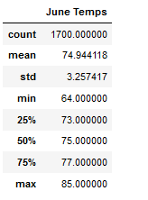
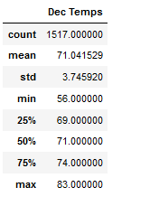
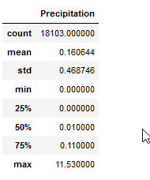
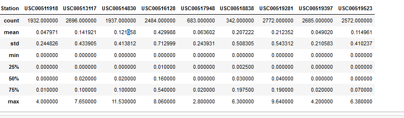

# Weather Analysis

## Overview

The purpose of the analysis is to take a closer look at the weather surrounding Oahu to see whether the weather conditions there will work for our proposed business of a surf & shake destination.

## Results

Below are two summary statistics tables for weather historically in June and December.

June Temperature:

December Temperature:

Here are the observations:

- There is a difference of 3°F in mean temperature between June and December i.e. it is hotter in June than December on average.
- The weather distribution is closer together in June than in December. We can observe as June has a smaller standard deviation than December. 
- Both December and June have similar distribution of data between 25th and 75th percentiles, where it is about 3°F from roughly where the mean is.

## Summary

Based on the results, we see that in the summer & winter (using June & December as proxies), the weather hovers around 69°F to 77°F yearround, as at least 50% of the data is within that range, meaning that temperature does not fluctuate that much (although there will be sudden peaks/valleys).

We had also ran another query where we looked at the precipitation data to see how often it rains and its intensity in Oahu i.e. presumably surfing is not favorable when its raining. As we can see, at least 50% of the time Oahu is close to being clear skies, and at the 75th percentile we see light rain at 0.11.

Rain Data:

We can drill down further on precipitation data, where we can see the statistics of rain for each weather station. The thought process here is there may be less rain at certain locations either due to its location or elevation. From the table, we see that there is less rain on average at station USC00511918, meaning it may be more favourable to place our business near that area.

Station Data for Rain:

